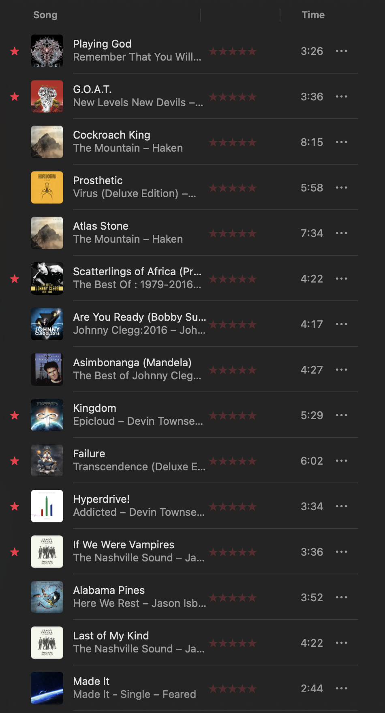

# Music Discovery

Discover new music based on the artists you already love.

This tool reads artists from tracks you've marked as **Loved** or **Favorited** in your Apple Music (or iTunes) library, finds similar artists via [music-map.com](https://www.music-map.com/), scores them by proximity, and filters out well-known artists so only genuine discoveries appear. Optionally builds an Apple Music playlist with top tracks from your discoveries.

## Introduction by the Designer (NetworkingGuru)

<figure>
  
  <figcaption><em>First run results. Small sample size, but out of the top 15 tracks, I loved 7 of them.</em></figcaption>
</figure>

So I’ve been searching for a decent music recommender since the 90’s, and have yet to find one that is right more than 10% of the time. Perhaps I am weird and I know I have eclectic taste, but I also thought the existing algos probably sucked. 

Years ago, I found music-map, and was **immediately** struck by the idea that this is how recommendations should be done: Find what the user likes, figure out what is related to that, and offer it. But to maximize relevance, I thought an approach where you took ALL of the user’s favorite artists and correlated them all, you should get a nice sorted list of possibles. 

Anyway, this seemed like a task right at the edge of my programming abilities, so I never got around to it. But then came Claude Code.

To learn Claude Code, I decided to vibe code this shit, but since I DO know Python, I did it in Python, in the hopes I could at least prevent the worst disasters. 😂 Still not sure how that worked, because I haven’t done a lot of looking through the code. But I can tell you, with *absolute* certainty, that it was MUCH more difficult than I thought. And that fact has caused me to re-evaluate my stance on AI.

Claude is fucking amazing. 

See, this fucking thing had more obstacles than anything I have ever seen. At one point, between trying to brute force the Music API and hex editing a database, Claude had music playing through my laptop and was actively walking all of the buttons (through accessibility? Who fucking knows, this shit is WILD man) trying to figure out how to add a goddamn song to a playlist that it couldn’t even SEE. I ended up with a playlist containing 1.3 million files and Claude briefly taking over my TV to my unending amusement and the consternation of my wife. This tool is unstoppable. 

Now, a few warnings before I end, because despite everything you see in this repo, I haven’t written **anything** except this intro. So all code, docs, etc., are all by Claude. Now, I can code, and I can code in Python, and I’m decent at both. But no one should use the —playlist function without a full backup and a priest. Don’t get me wrong: **IT FUCKING WORKS**, at least on my Mac. But this is the part of the script that had my Mac acting like the antagonist of the Exorcist. It made a 1.3 **MILLION** entry playlist that BROKE APPLE MUSIC. It’s fucking evil, but it’s also awesome. And it works, but don’t use it. You have been warned, no refunds, shirt and shoes required, God be with ye.

## Quick Start

```bash
git clone https://github.com/networkingguru/music-discovery.git
cd music-discovery
pip install -r requirements.txt
playwright install chromium
python music_discovery.py
```

## Requirements

- **Python 3.9+**
- **macOS or Windows**
- **Apple Music or iTunes library** exported as XML, with loved or favorited tracks (the tool discovers new artists based on artists you've loved — without any loved or favorited tracks, it has nothing to work with)
- **Last.fm API key** (optional, free) — improves results by filtering out well-known artists
- **Apple Music subscription** (recommended for playlist building) — without one, adding tracks to your library may purchase them individually instead of streaming. See the warning in Usage below.

## Usage

```bash
# Basic discovery
python music_discovery.py

# Specify a custom library path
python music_discovery.py --library ~/path/to/Library.xml

# Discovery + build an Apple Music playlist
python music_discovery.py --playlist
```

> **Important:** Playlist building adds tracks to your Apple Music library. Without an active Apple Music subscription, this may purchase individual tracks instead of streaming them. The author is not responsible for any charges incurred. Use at your own risk.

## Platform Notes

| Feature | macOS | Windows |
|---------|-------|---------|
| Artist discovery | Yes | Yes |
| Last.fm filtering | Yes | Yes |
| Playlist building | Yes (native) | Yes (XML import) |

## How It Works

See [Technical Overview](docs/how-it-works.md) for the full pipeline, scoring algorithm, and architecture.

## Documentation

- [User Guide](docs/user-guide.md) — installation, first run, configuration, troubleshooting
- [Technical Overview](docs/how-it-works.md) — how the scoring, filtering, and playlist systems work
- [Clever Bits](docs/clever-bits.md) — the non-obvious engineering challenges
- [Changelog](CHANGELOG.md) — milestones and notable incidents

## License

[MIT](LICENSE)
